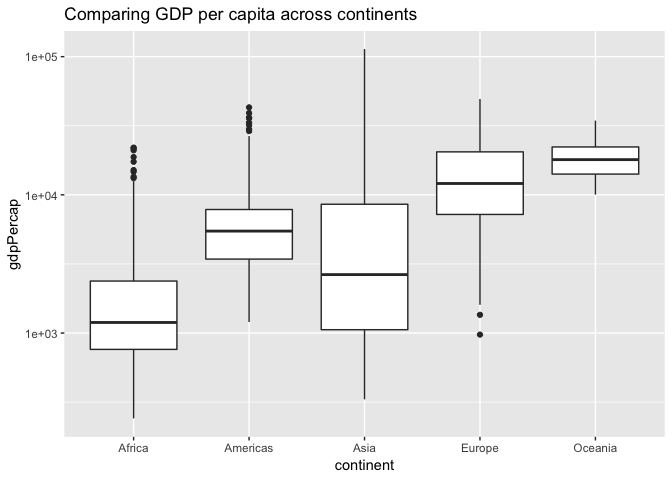
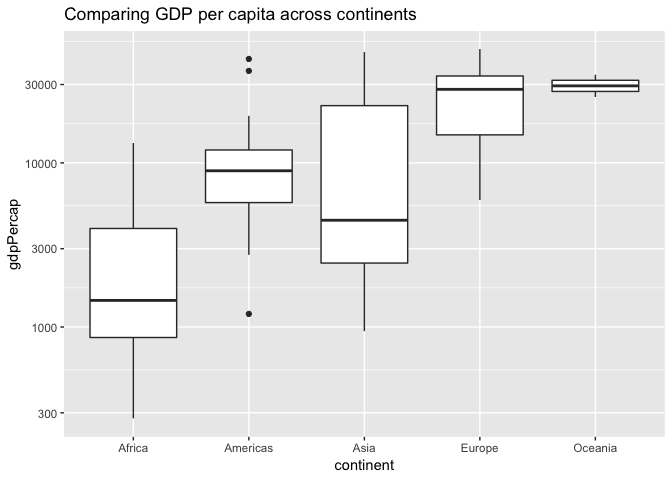
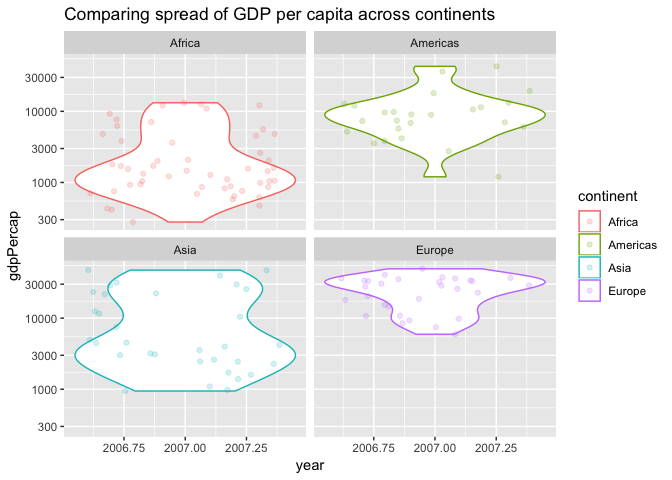
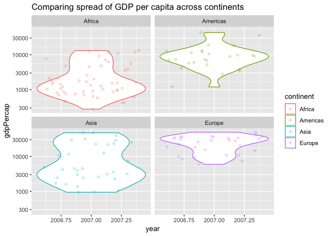
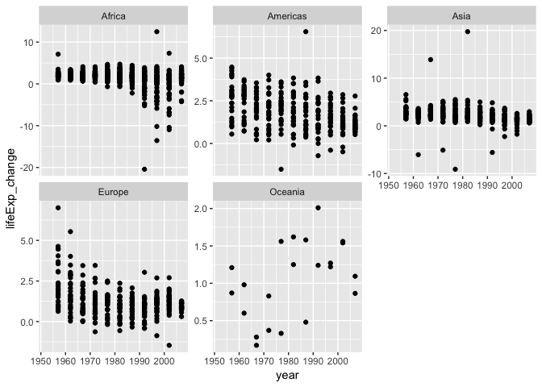
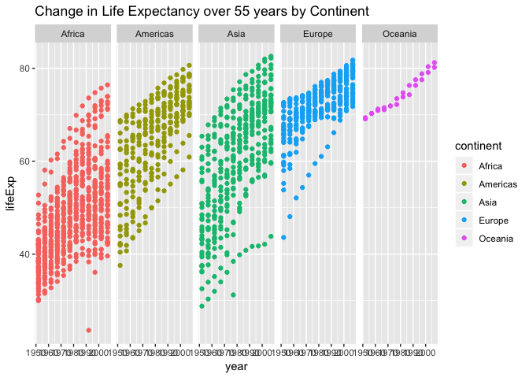
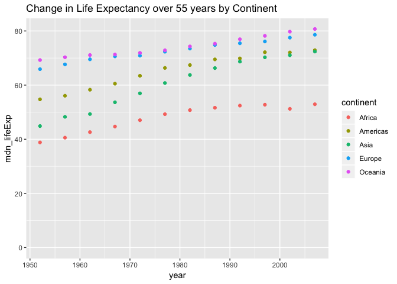

Hw03\_couBC
================
CouBC
2018-10-01

Assignment 3:
=============

Loading tidyverse and gapminder.

``` r
library(gapminder)
library(tidyverse)
```

    ## ── Attaching packages ────────────────────────────────── tidyverse 1.2.1 ──

    ## ✔ ggplot2 3.0.0     ✔ purrr   0.2.5
    ## ✔ tibble  1.4.2     ✔ dplyr   0.7.6
    ## ✔ tidyr   0.8.1     ✔ stringr 1.2.0
    ## ✔ readr   1.1.1     ✔ forcats 0.3.0

    ## ── Conflicts ───────────────────────────────────── tidyverse_conflicts() ──
    ## ✖ dplyr::filter() masks stats::filter()
    ## ✖ dplyr::lag()    masks stats::lag()

Task 1:
=======

Get the maximum and minimum of GDP per capita for all continents

``` r
glimpse(gapminder) 
```

    ## Observations: 1,704
    ## Variables: 6
    ## $ country   <fct> Afghanistan, Afghanistan, Afghanistan, Afghanistan, ...
    ## $ continent <fct> Asia, Asia, Asia, Asia, Asia, Asia, Asia, Asia, Asia...
    ## $ year      <int> 1952, 1957, 1962, 1967, 1972, 1977, 1982, 1987, 1992...
    ## $ lifeExp   <dbl> 28.801, 30.332, 31.997, 34.020, 36.088, 38.438, 39.8...
    ## $ pop       <int> 8425333, 9240934, 10267083, 11537966, 13079460, 1488...
    ## $ gdpPercap <dbl> 779.4453, 820.8530, 853.1007, 836.1971, 739.9811, 78...

At first I tried this - but this is not helpful at all as you would have to scroll through all the rows to try to find the max and min manually.

``` r
gapminder %>%
  arrange(gdpPercap)
```

    ## # A tibble: 1,704 x 6
    ##    country          continent  year lifeExp      pop gdpPercap
    ##    <fct>            <fct>     <int>   <dbl>    <int>     <dbl>
    ##  1 Congo, Dem. Rep. Africa     2002    45.0 55379852      241.
    ##  2 Congo, Dem. Rep. Africa     2007    46.5 64606759      278.
    ##  3 Lesotho          Africa     1952    42.1   748747      299.
    ##  4 Guinea-Bissau    Africa     1952    32.5   580653      300.
    ##  5 Congo, Dem. Rep. Africa     1997    42.6 47798986      312.
    ##  6 Eritrea          Africa     1952    35.9  1438760      329.
    ##  7 Myanmar          Asia       1952    36.3 20092996      331 
    ##  8 Lesotho          Africa     1957    45.0   813338      336.
    ##  9 Burundi          Africa     1952    39.0  2445618      339.
    ## 10 Eritrea          Africa     1957    38.0  1542611      344.
    ## # ... with 1,694 more rows

I tried a couple of different combinations with max(gdpPercap) and min(gdpPercap) and pmax(x) and pmin(x) but I couldn't get it to work telling me there were errors in my argument. I looked at Jenny's tutorial on one-table verbs (<http://stat545.com/block010_dplyr-end-single-table.html>) which looked at max and min life expectancie: summarize(min\_lifeExp = min(lifeExp), max\_lifeExp = max(lifeExp)) and tried that for gdpPercap. Voila:

``` r
gapminder %>%
  group_by(continent) %>% 
  summarise(max_gdpPercap = max(gdpPercap), min_gdpPercap = min(gdpPercap)) %>% 
knitr::kable()
```

| continent |  max\_gdpPercap|  min\_gdpPercap|
|:----------|---------------:|---------------:|
| Africa    |        21951.21|        241.1659|
| Americas  |        42951.65|       1201.6372|
| Asia      |       113523.13|        331.0000|
| Europe    |        49357.19|        973.5332|
| Oceania   |        34435.37|      10039.5956|

``` r
gapminder %>%
  group_by(continent) %>% 
  summarize(max(gdpPercap), min(gdpPercap))
```

    ## # A tibble: 5 x 3
    ##   continent `max(gdpPercap)` `min(gdpPercap)`
    ##   <fct>                <dbl>            <dbl>
    ## 1 Africa              21951.             241.
    ## 2 Americas            42952.            1202.
    ## 3 Asia               113523.             331 
    ## 4 Europe              49357.             974.
    ## 5 Oceania             34435.           10040.

Because it may be more meaningful to know max and min gdpPercap for a particular year, in the next section, I filtered to 2007:

``` r
gapminder %>%
  group_by(continent) %>% 
  filter(year == 2007) %>% 
  summarise(max_gdpPercap = max(gdpPercap), min_gdpPercap = min(gdpPercap)) %>% 
knitr::kable()
```

| continent |  max\_gdpPercap|  min\_gdpPercap|
|:----------|---------------:|---------------:|
| Africa    |        13206.48|        277.5519|
| Americas  |        42951.65|       1201.6372|
| Asia      |        47306.99|        944.0000|
| Europe    |        49357.19|       5937.0295|
| Oceania   |        34435.37|      25185.0091|

In order to visualize this in a graph:

``` r
ggplot(gapminder, aes(x=continent, y=gdpPercap)) +geom_boxplot() + scale_y_log10() + ggtitle("Comparing GDP per capita across continents")
```



Only looking at year 2007 data for gdp Per capita across continents:

``` r
gapminder_2007 <- gapminder %>%
  filter(year == 2007)

ggplot(gapminder_2007, aes(x = continent, y = gdpPercap)) +
  geom_boxplot() +
  scale_y_log10() + ggtitle("Comparing GDP per capita across continents")
```



Task 2
======

Look at spread of GDP per capita within the continents.

``` r
gapminder %>% 
  group_by(continent) %>% 
  filter(year == 2007) %>% 
  select(country, gdpPercap) %>% 
  summarize(sd_gdpPercap = sd(gdpPercap)) %>% 
knitr::kable()
```

    ## Adding missing grouping variables: `continent`

| continent |  sd\_gdpPercap|
|:----------|--------------:|
| Africa    |       3618.163|
| Americas  |       9713.209|
| Asia      |      14154.937|
| Europe    |      11800.340|
| Oceania   |       6540.991|

These are my different attempts at visualising the spread of gdp Per capita across the continents in the year 2007.

I tried looking at spread in 2007 using boxplots which is redundant useful for showing more specific information (IQR, range) about the the spread of gdpPercap between each continent.

``` r
gapminder_2007 <- gapminder %>%
  filter(year == 2007)
ggplot(gapminder_2007, aes(x = continent, y = gdpPercap)) +
  geom_boxplot() +
   scale_y_log10() +
    ggtitle("Comparing GDP per capita across continents using boxplots")
```



In order to try some of the fancier plots we learned in class I opted to make a violin plus jittler plot. This is more informative than the boxplot because it shows more of the distribution and contains the country data points.

I eliminated Oceania as a continent as it had an empty graph (no violin) with 2 datapoints. It looks like Asia has a wide spread of gdpPercap and Europe has a small spread.wh

``` r
gapminder_2007 <- gapminder %>%
  filter(year == 2007, continent != "Oceania")

ggplot(gapminder_2007, aes(x = year, y = gdpPercap, color = continent)) +
  geom_violin() + facet_wrap(~continent) + 
  geom_jitter(alpha =.2) +
  scale_y_log10() +
  ggtitle("Comparing spread of GDP per capita across continents")
```



Task 3
======

How is life expectancy changing over time on different continents?

Need to figure out how to find the difference in lifeExp between the latest data point (2007) and first data point (1952).

After trying several unsuccessful ways of creating a new variable that looks at change in lifeExp, I looked at the participation repo for cm\_08.

``` r
gapminder %>% 
    group_by(continent) %>% 
    transmute(lifeExp_change = lifeExp - lag(lifeExp)) %>% 
    summarize(median_change = median(lifeExp_change, na.rm = T)) %>%
  knitr::kable()
```

| continent |  median\_change|
|:----------|---------------:|
| Africa    |           1.795|
| Americas  |           1.582|
| Asia      |           2.052|
| Europe    |           1.030|
| Oceania   |           1.094|

To graph this

``` r
gapminder %>% 
    group_by(continent, country) %>% 
    mutate(lifeExp_change = lifeExp - lag(lifeExp)) %>% 
    ggplot(aes(year, lifeExp_change)) +
    geom_point() + facet_wrap(~continent, scales = "free_y")
```

    ## Warning: Removed 142 rows containing missing values (geom_point).



``` r
ggplot(gapminder, aes(x = year, y = lifeExp, color = continent)) +
  geom_point() +
  facet_grid(~continent) +
  ggtitle("Change in Life Expectancy over 55 years by Continent") 
```



I tried another way of looking at it using the median of each continent. The resulting graph is less busy than the one above. I adapted the code from: <https://www.mrozinski.com.pl/posts/introduction-to-tidyverse/>

``` r
by_year_continent <- gapminder %>%
      group_by(continent, year) %>% 
      summarize(mdn_lifeExp = median(lifeExp))

ggplot(by_year_continent, aes(x=year, y=mdn_lifeExp, color=continent)) + 
      geom_point() + 
      expand_limits(y=0) +
 ggtitle("Change in Life Expectancy over 55 years by Continent")
```


